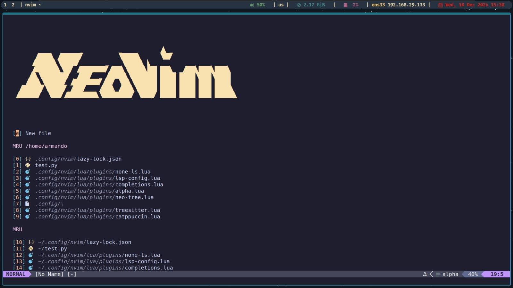
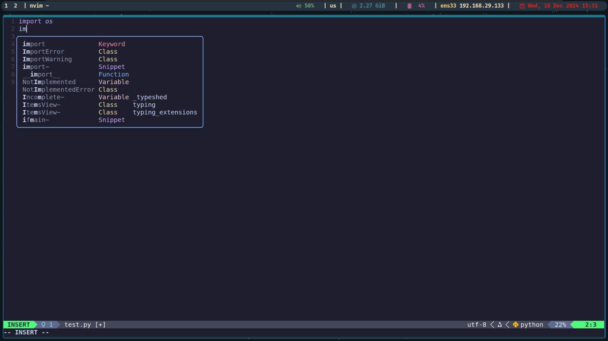
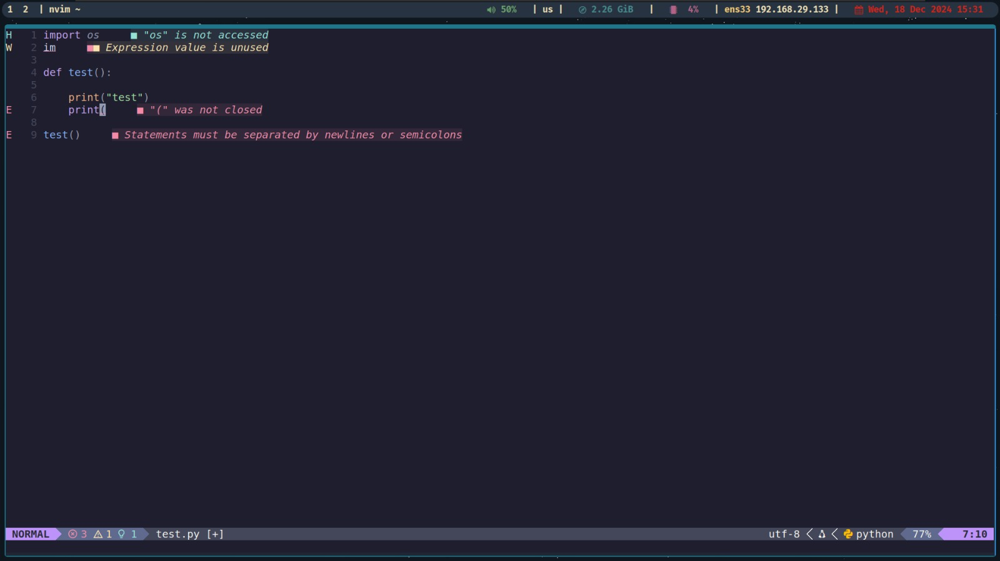
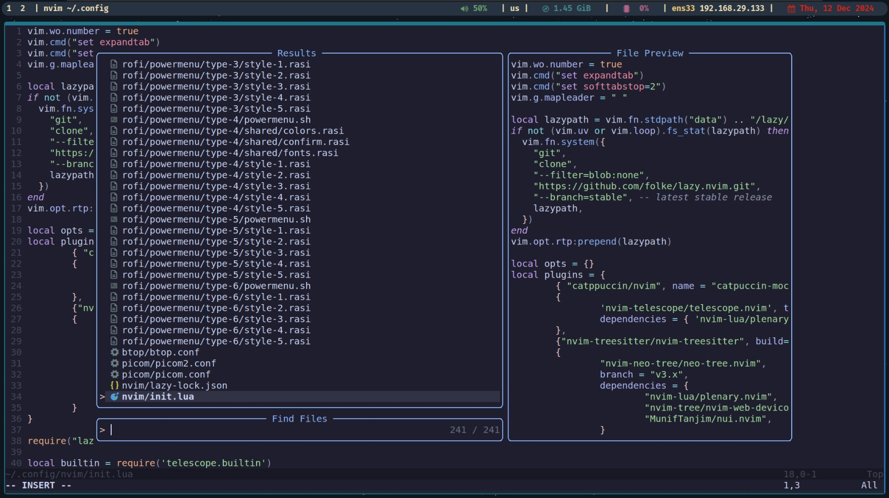
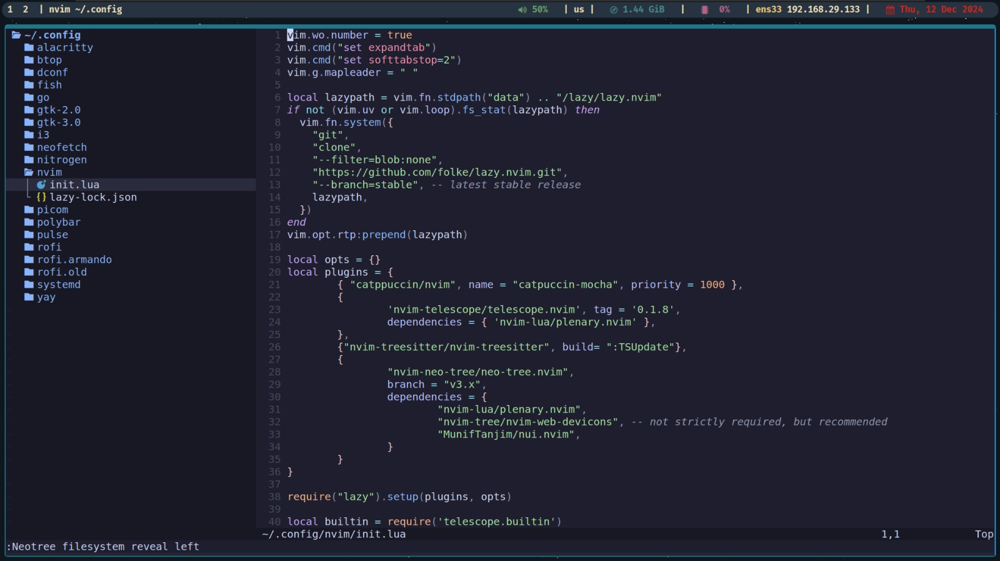
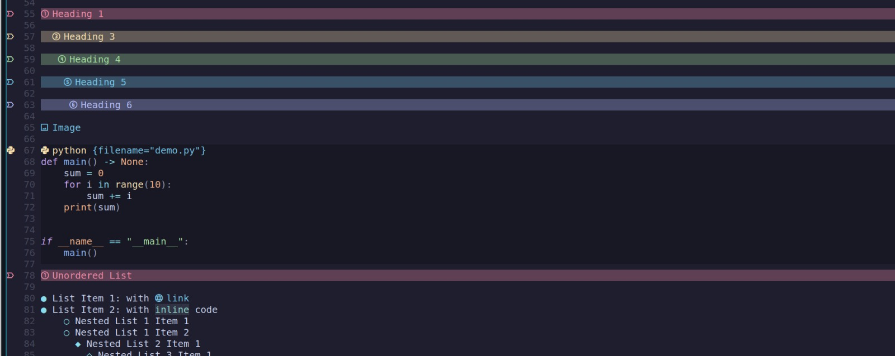
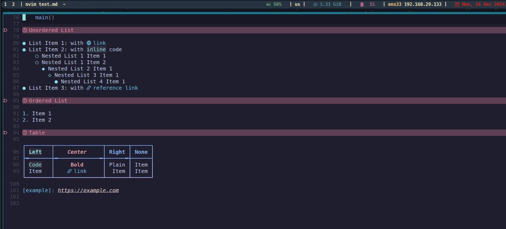
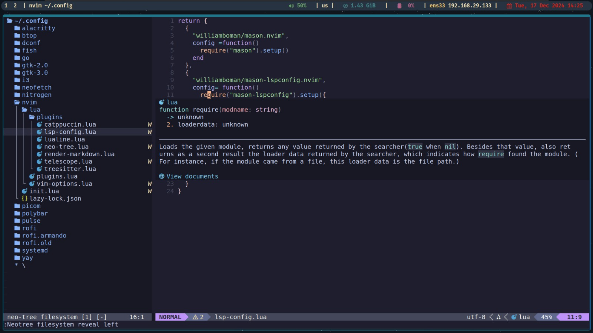
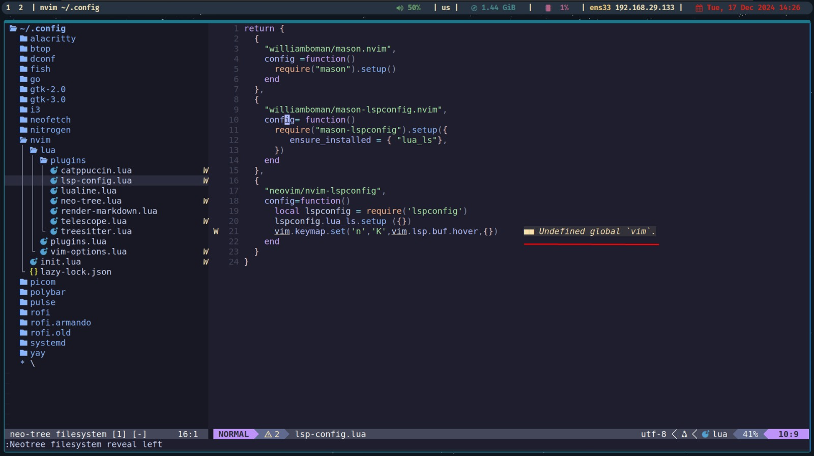
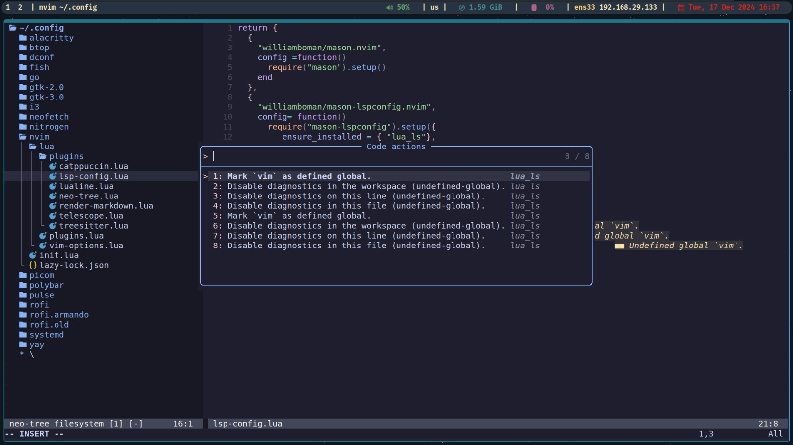

# Neovim Plugins Configuration

This document provides an overview of the Neovim plugins included in the setup, along with their respective branches, commit hashes, and descriptions. Each plugin serves a unique purpose to enhance your Neovim experience.

## Plugin List with Descriptions

### LuaSnip
- **Description**: A highly configurable snippet engine written in Lua for Neovim.
- [Repository GitHub](https://github.com/L3MON4D3/LuaSnip)

### Alpha-nvim
- **Description**: A customizable startup screen for Neovim.
- [Repository GitHub](https://github.com/goolord/alpha-nvim)

### Catppuccin Mocha
- **Description**: A theme for Neovim with support for various customizations.
- [Repository GitHub](https://github.com/catppuccin/nvim)

### Cmp-nvim-lsp
- **Description**: Provides integration between nvim-cmp and Neovim's LSP client.
- [Repository GitHub](https://github.com/hrsh7th/cmp-nvim-lsp)

### Cmp_luasnip
- **Description**: Integrates LuaSnip with nvim-cmp for snippet-based completions.
- [Repository GitHub](https://github.com/saadparwaiz1/cmp_luasnip)

### Friendly Snippets
- **Description**: A collection of ready-to-use snippets for various languages and frameworks.
- [Repository GitHub](https://github.com/rafamadriz/friendly-snippets)

### Lazy.nvim
- **Description**: A plugin manager for Neovim that emphasizes speed and efficiency.
- [Repository GitHub](https://github.com/folke/lazy.nvim)

### Lualine.nvim
- **Description**: A highly customizable statusline for Neovim written in Lua.
- [Repository GitHub](https://github.com/nvim-lualine/lualine.nvim)

### Mason-lspconfig.nvim

- **Description**: An extension for mason.nvim to simplify LSP server configuration.
- [Repository GitHub](https://github.com/williamboman/mason-lspconfig.nvim)

### Mason.nvim

- **Description**: A package manager for Neovim to facilitate installation of LSP servers, DAP, linters, and formatters.
- [Repository GitHub](https://github.com/williamboman/mason.nvim)

### Mini.nvim

- **Description**: A collection of independent, small Neovim modules to enhance the editor experience.
- [Repository GitHub](https://github.com/echasnovski/mini.nvim)

### Neo-tree.nvim

- **Description**: A file explorer for Neovim written in Lua, designed to be highly extensible.
- [Repository GitHub](https://github.com/nvim-neo-tree/neo-tree.nvim)

### None-ls-extras.nvim
- **Description**: Additional integrations and sources for none-ls.nvim.
- [Repository GitHub](https://github.com/jose-elias-alvarez/null-ls.nvim)

### None-ls.nvim

- **Description**: Enables using linters, formatters, and other sources as LSP servers for Neovim.
- [Repository GitHub](https://github.com/jose-elias-alvarez/null-ls.nvim)

### Nui.nvim

- **Description**: A UI library for Neovim providing reusable UI components.
- [Repository GitHub](https://github.com/MunifTanjim/nui.nvim)

### Nvim-cmp

- **Description**: A Lua-written completion plugin for Neovim, highly extensible.
- [Repository GitHub](https://github.com/hrsh7th/nvim-cmp)

### Nvim-lspconfig

- **Description**: A collection of configurations for Neovim's LSP client, simplifying server setup.
- [Repository GitHub](https://github.com/neovim/nvim-lspconfig)

### Nvim-treesitter

- **Description**: Provides advanced source code parsing for Neovim, enhancing syntax highlighting and more.
- [Repository GitHub](https://github.com/nvim-treesitter/nvim-treesitter)

### Nvim-web-devicons

- **Description**: Adds file icons for Neovim, improving visual experience.
- [Repository GitHub](https://github.com/kyazdani42/nvim-web-devicons)

### Plenary.nvim

- **Description**: A Lua function library used by various Neovim plugins.
- [Repository GitHub](https://github.com/nvim-lua/plenary.nvim)

### Render-markdown.nvim

- **Description**: A plugin to render Markdown files directly in Neovim.
- [Repository GitHub](https://github.com/ellisonleao/glow.nvim)

### Telescope-ui-select.nvim

- **Description**: An extension for Telescope replacing default Neovim UI selections with Telescope-powered ones.
- [Repository GitHub](https://github.com/nvim-telescope/telescope-ui-select.nvim)

### Telescope.nvim

- **Description**: A fuzzy finder plugin for Neovim, enabling efficient searching, filtering, and previewing.
- [Repository GitHub](https://github.com/nvim-telescope/telescope.nvim)

## Usage Tips
- Make sure your Neovim setup includes a proper plugin manager such as [lazy.nvim](https://github.com/folke/lazy.nvim) or similar.
- Regularly update your plugins to get the latest features and bug fixes.
- Use the specific branches and commits listed here to ensure a stable configuration.

## Troubleshooting
If you encounter issues with any of the plugins:
- Check the Neovim logs for errors.
- Verify the plugin's documentation for dependencies or additional setup steps.
- Ensure that the plugin's branch and commit are correctly specified in your configuration.

## Additional Notes
This setup includes a mix of plugins for:
- Snippets (LuaSnip, friendly-snippets)
- LSP configuration (nvim-lspconfig, mason.nvim, cmp-nvim-lsp)
- UI enhancements (alpha-nvim, lualine.nvim, catpuccin-mocha)
- File navigation (neo-tree.nvim, telescope.nvim)
- Formatting and diagnostics (none-ls.nvim, none-ls-extras.nvim)

Keep your Neovim configuration organized and regularly reviewed for optimal performance.

# Neovim screen

 

 

 

 

 

 

